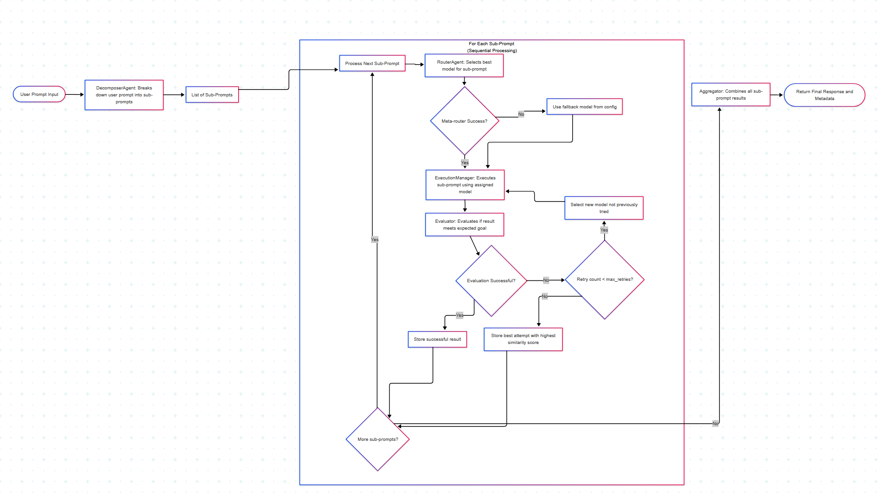

# SAGE - Sequential Agent Goal Execution Protocol

SAGE is an AI protocol that dynamically manages multi-LLM workflows by breaking down user prompts into validated, goal-driven sub-tasks processed by the most suitable language models.

## Core Components

- **Decomposer Agent**: Breaks main prompt into meaningful sub-prompts
- **Router Agent**: Selects the best model for each sub-task
- **Execution Manager**: Runs sub-prompts sequentially with context
- **Evaluator**: Uses an LLM-based approach to judge if each sub-task's response fulfills the sub-task, by prompting a selected LLM (default: Deepseek) to act as an expert evaluator. The evaluator model is configurable and can be changed in the config.
- **Retry/Reassign Handler**: Manages failed tasks
- **Aggregator**: Combines outputs into final response

## Flowchart of Execution


## Installation

```bash
pip install -e .
```

## Usage

```python
from sage import SAGE

# Initialize the protocol
sage = SAGE()

# Process a user prompt
result = sage.process_prompt("Your prompt here")
```

## Supported Models

- gemma3:4b (Ollama local)
- deepseek-r1:1.5b (Ollama local)
- qwen3:1.7b (Ollama local)
- gemini-2.5-flash (Gemini, cloud)

> **Note:** You can now use Gemini (cloud) as an LLM provider. See below for setup instructions.

### Using Gemini (Cloud LLM)

To use Gemini as a cloud LLM provider, you must add your Gemini API key to a `.env` file in the project root:

```
GEMINI_API_KEY=your_gemini_api_key_here
```

The protocol will automatically detect and use Gemini for any sub-task assigned to a Gemini model (e.g., `gemini-2.5-flash`).

## Development

1. Create a virtual environment:
```bash
python -m venv venv
source venv/bin/activate  # On Windows: venv\Scripts\activate
```

2. Install development dependencies:
```bash
pip install -r requirements.txt
```

3. Run the protocol for testing or demonstration:
```bash
python src/test_sage_protocol.py
```
You can also provide a custom prompt:
```bash
python src/test_sage_protocol.py --prompt "Your custom prompt here"
```
Or show detailed output for each sub-prompt:
```bash
python src/test_sage_protocol.py --verbose
```

> **Note:** There are currently no traditional pytest-based tests in this project. All protocol testing and demonstration is performed via the CLI script above.

## License

MIT License

## Contributing

SAGE is completely open source and we welcome contributions from the community!

**How to contribute:**
1. **Fork** this repository to your own GitHub account.
2. **Clone** your fork to your local machine.
3. **Create a new branch** for your feature or bugfix:
   ```bash
   git checkout -b my-feature
   ```
4. **Make your changes** and commit them with clear messages.
5. **Push** your branch to your fork:
   ```bash
   git push origin my-feature
   ```
6. **Open a Pull Request** on GitHub, describing your changes and why they should be merged.

**Guidelines:**
- Please open an issue if you want to discuss a bug or feature before submitting code.
- Try to follow the existing code style and structure.
- If possible, test your changes before submitting.
- Be respectful and constructive in all interactions.

We appreciate all kinds of contributions—bug reports, feature requests, documentation improvements, and code!

## Supported Local Models

- `gemma3:4b`
- `deepseek-r1:1.5b`
- `qwen3:1.7b`

To use these models, ensure they are installed in your local Ollama instance:

```sh
ollama pull gemma3:4b
deepeek-r1:1.5b
ollama pull qwen3:1.7b
```

### Configuration

Edit `config/settings.yaml` to set available models. Example:

```yaml
available_models:
  - "gemma3:4b"
  - "deepseek-r1:1.5b"
  - "qwen3:1.7b"
```

## Project Directory Overview

- `src/` — Main source code for the protocol and CLI
- `src/sage/` — Core protocol package
- `src/sage/agents/` — All agent classes (decomposer, router, executor, evaluator, aggregator, base)
- `src/sage/core/` — Core models and utilities
- `src/test_sage_protocol.py` — CLI runner and test entry point
- `config/` — Configuration files (e.g., `settings.yaml`)
- `requirements.txt` — Python dependencies
- `setup.py` — Package setup
- `SAGE.spec.yaml` — Protocol specification (see below)
- `sage_protocol.log` — Log file for all runs (debugging/audit)
- `README.md` — This documentation

## Command Line Usage

Run the protocol with the default test prompt:

```bash
python src/test_sage_protocol.py
```

Run with a custom prompt:

```bash
python src/test_sage_protocol.py --prompt "Your custom prompt here"
```

Show detailed output for each sub-prompt:

```bash
python src/test_sage_protocol.py --verbose
```

## Log File

All protocol runs are logged to `sage_protocol.log` in the project root. This file contains detailed step-by-step logs for debugging and audit trails.

## Extensibility

SAGE is designed to be modular and extensible. You can:
- Add new agent types (e.g., for planning, validation, or post-processing) in `src/sage/agents/`
- Integrate additional LLM providers or models
- Customize decomposition, routing, or evaluation logic
- Plug in custom similarity metrics or feedback mechanisms

## Protocol Specification

The protocol is formally described in `SAGE.spec.yaml`. This file documents all components, workflow steps, configuration options, and extensibility points. Use it as a reference for implementation or extension.

## Semantic Similarity Fallback (Evaluator)

If LLM-based evaluation is unavailable (e.g., Ollama is not running), SAGE will automatically use semantic similarity (cosine similarity of sentence embeddings) between the model's answer and the subprompt content to determine success/failure. This requires the `sentence-transformers` package. If it is not installed, SAGE will fallback to string similarity.

**Dependency:**
- `sentence-transformers>=2.2.2`

You can tune the similarity threshold in your config (`similarity_threshold`).
