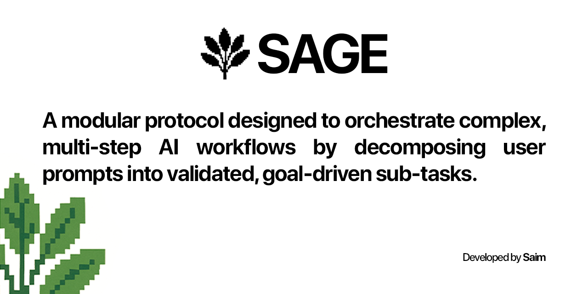
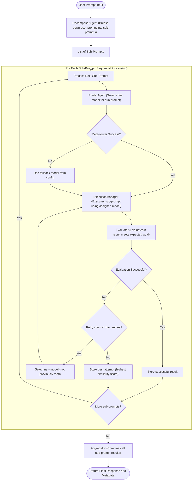

<p align="center">
  
</p>

# SAGE - Sequential Agent Goal Execution Protocol

SAGE is an AI protocol that dynamically manages multi-LLM workflows by breaking down user prompts into validated, goal-driven sub-tasks processed by the most suitable language models.

## Core Components

- **Decomposer Agent**: Breaks main prompt into meaningful sub-prompts
- **Router Agent**: Selects the best model for each sub-task
- **Execution Manager**: Runs sub-prompts sequentially with context
- **Evaluator**: Uses an LLM-based approach to judge if each sub-task's response fulfills the sub-task, by prompting a selected LLM (default: Deepseek) to act as an expert evaluator. The evaluator model is configurable and can be changed in the config.
- **Retry/Reassign Handler**: Manages failed tasks
- **Aggregator**: Combines outputs into final response

## Flowchart of Execution



</details>

## Installation

```bash
pip install -e .
```

## Usage

```python
from sage import SAGE

# Initialize the protocol
sage = SAGE()

# Process a user prompt
result = sage.process_prompt("Your prompt here")
```

## Supported Models (Early Version)

- gemma3:4b (Ollama local)
- deepseek-r1:1.5b (Ollama local)
- qwen3:1.7b (Ollama local)

> **Note:** Only local LLMs running via Ollama are supported in this early version. Support for cloud LLMs (e.g., GPT, Claude) will be added in the future.

## Development

1. Create a virtual environment:
```bash
python -m venv venv
source venv/bin/activate  # On Windows: venv\Scripts\activate
```

2. Install development dependencies:
```bash
pip install -r requirements.txt
```

3. Run tests:
```bash
pytest
```

## License

MIT License

## Supported Local Models

- `gemma3:4b`
- `deepseek-r1:1.5b`
- `qwen3:1.7b`

To use these models, ensure they are installed in your local Ollama instance:

```sh
ollama pull gemma3:4b
deepeek-r1:1.5b
ollama pull qwen3:1.7b
```

### Configuration

Edit `config/settings.yaml` to set available models. Example:

```yaml
available_models:
  - "gemma3:4b"
  - "deepseek-r1:1.5b"
  - "qwen3:1.7b"
```

## Project Directory Overview

- `src/` — Main source code for the protocol and CLI
- `src/sage/` — Core protocol package
- `src/sage/agents/` — All agent classes (decomposer, router, executor, evaluator, aggregator, base)
- `src/sage/core/` — Core models and utilities
- `src/test_sage_protocol.py` — CLI runner and test entry point
- `config/` — Configuration files (e.g., `settings.yaml`)
- `requirements.txt` — Python dependencies
- `setup.py` — Package setup
- `SAGE.spec.yaml` — Protocol specification (see below)
- `sage_protocol.log` — Log file for all runs (debugging/audit)
- `README.md` — This documentation

## Command Line Usage

Run the protocol with the default test prompt:

```bash
python src/test_sage_protocol.py
```

Run with a custom prompt:

```bash
python src/test_sage_protocol.py --prompt "Your custom prompt here"
```

Show detailed output for each sub-prompt:

```bash
python src/test_sage_protocol.py --verbose
```

## Log File

All protocol runs are logged to `sage_protocol.log` in the project root. This file contains detailed step-by-step logs for debugging and audit trails.

## Extensibility

SAGE is designed to be modular and extensible. You can:
- Add new agent types (e.g., for planning, validation, or post-processing) in `src/sage/agents/`
- Integrate additional LLM providers or models
- Customize decomposition, routing, or evaluation logic
- Plug in custom similarity metrics or feedback mechanisms

## Protocol Specification

The protocol is formally described in `SAGE.spec.yaml`. This file documents all components, workflow steps, configuration options, and extensibility points. Use it as a reference for implementation or extension.
